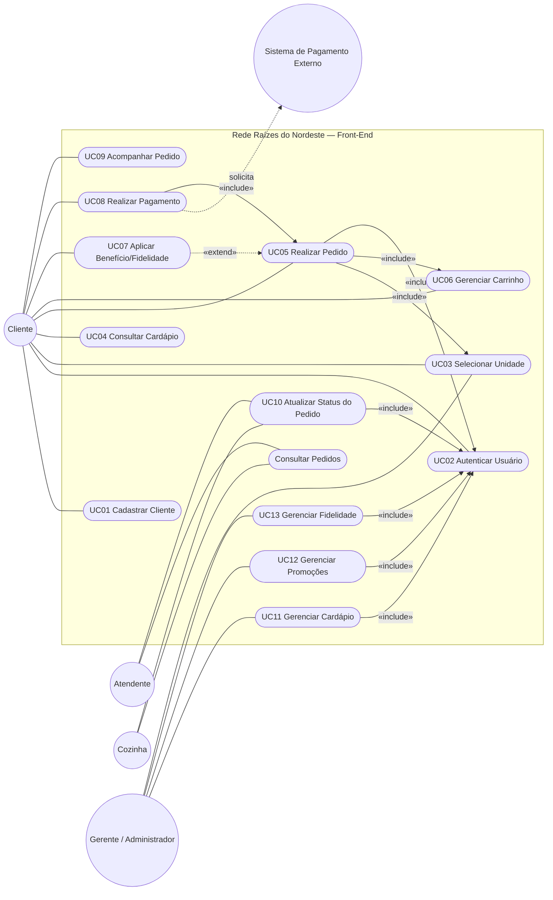
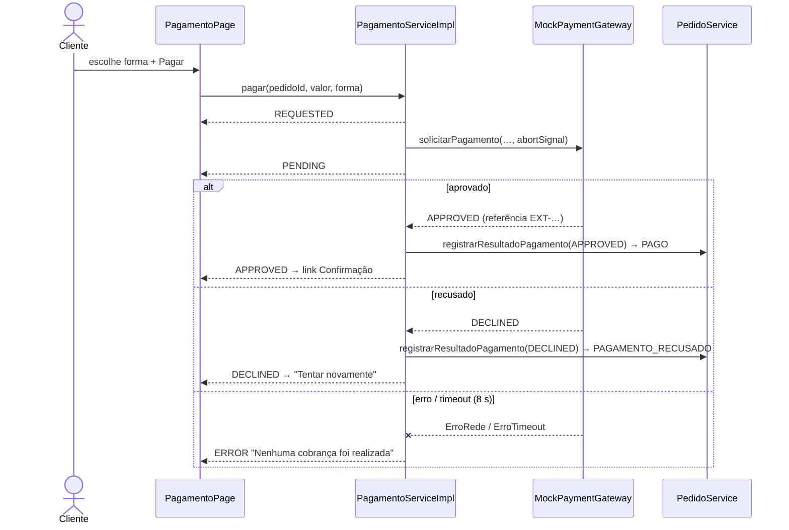
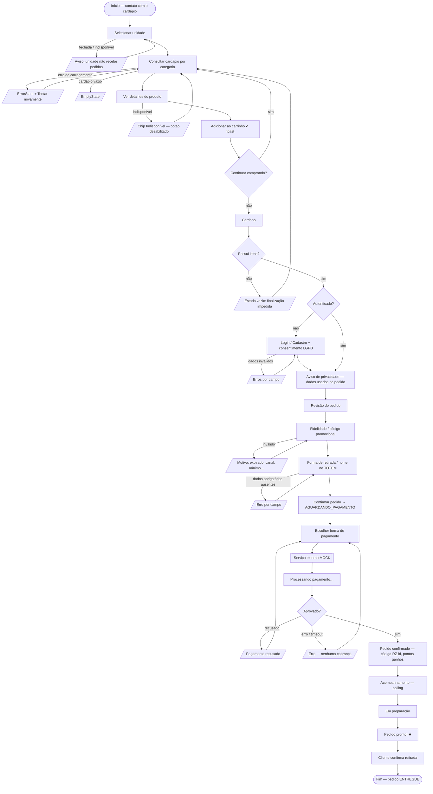

# Rede Raízes do Nordeste — Documentação Acadêmica do Front-End

**Projeto Multidisciplinar – Trilha Front-End – 2026 · Opção B (Codificação/Desenvolvimento)**

> Convenção: tudo o que é **decisão de projeto** (e não requisito do roteiro) está marcado com *[DP]*.
> Esta é uma **simulação acadêmica** — nenhum pagamento real é processado (RN05).

---

## 1. Introdução e Objetivos

A Rede Raízes do Nordeste é uma rede de lanchonetes em expansão (Recife, Salvador, Fortaleza e São Paulo) que precisa oferecer pedidos digitais coerentes em três canais — **WEB**, **APP** e **TOTEM** — com cardápio por unidade, programa de fidelidade, promoções, pagamento por serviço externo e conformidade com a LGPD.

Objetivos do Front-End:

1. Permitir o fluxo completo do cliente: escolher unidade → consultar cardápio → montar carrinho → autenticar → revisar/aplicar benefício → pagar (MOCK) → acompanhar → retirar.
2. Adaptar a mesma aplicação aos três canais, com uma única base de código e componentes reutilizáveis *[DP]*.
3. Integrar-se conceitualmente ao Back-End Spring Boot já existente (`raizes-do-nordeste-backend`), com camada de serviços intercambiável Mock ⇄ API *[DP]*.
4. Representar a integração com um serviço externo de pagamento por meio de um gateway MOCK substituível.
5. Tornar a LGPD visível na interface (consentimento, finalidade, minimização, direitos do titular).
6. Entregar qualidade verificável: TypeScript estrito, lint, build, testes automatizados e validação em navegador.

## 2. Análise do Problema

**Contexto de negócio.** A rede cresce por unidades com cardápios e preços regionais distintos (ex.: tapioca custa R$ 12,00 em Recife e R$ 14,00 em Salvador com variação de recheio). Clientes recorrentes esperam fidelização (pontos, níveis, desconto) e campanhas (códigos promocionais por canal/unidade/período). O atendimento acontece em balcão (TOTEM), no celular (APP) e no navegador (WEB).

**Estado inicial do repositório.** A análise (Fase 1) encontrou apenas o Back-End (Java 17 / Spring Boot 3 / H2 / JWT) com endpoints de unidades, cardápio, clientes, fidelidade, pedidos e pagamento simulado. **Não existia Front-End**; ele foi criado do zero *[DP]*, respeitando os contratos do Back-End (IDs, status de pedido, regras de fidelidade e usuários seed).

**Problemas a resolver na interface:**

| Problema | Resposta de projeto |
|---|---|
| Cardápio e preço variam por unidade | Unidade é contexto global (`UnitContext`); carrinho pertence a uma única unidade (RN01) |
| Três canais, uma equipe | Uma SPA responsiva + atributo `data-canal` (WEB/APP/TOTEM) que ajusta densidade, alvos de toque e navegação |
| Pagamento externo sem cobrar de verdade | `PaymentGateway` (interface) + `MockPaymentGateway` com cenários APROVADO/RECUSADO/ERRO/TIMEOUT |
| LGPD não pode ser só texto | Consentimento no cadastro, banner de aviso, página de privacidade, "Meus dados" com revogação/anonimização, fidelidade condicionada ao consentimento |
| Back-End pode não estar disponível na avaliação | Fonte de dados MOCK completa em `localStorage`, com latência e falha de comunicação simuláveis |
| Feedback em todas as ações | Estados LOADING/EMPTY/SUCCESS/ERROR/DISABLED/PROCESSING padronizados (`useAsync`, `States.tsx`, `PaymentStatus`) |

**Atores:** Cliente, Atendente, Cozinha, Gerente/Administrador e Sistema de Pagamento Externo (ver §5).

## 3. Requisitos Funcionais

| ID | Requisito | Onde está implementado | Status |
|---|---|---|---|
| RF01 | Cadastro de clientes | `RegisterForm`, `CadastroPage`, `AuthServiceMock.cadastrar` | Implementado |
| RF02 | Autenticação | `LoginForm`, `LoginPage`, `AuthContext`, JWT simulado (HS256 fake) / `/auth/login` na API | Implementado |
| RF03 | Cardápio por unidade | `UnidadesPage`, `CardapioPage`, `CardapioService.cardapioDaUnidade` | Implementado |
| RF04 | Seleção de produtos | `ProductCard`, `CategoryMenu` | Implementado |
| RF05 | Detalhes do produto | `ProdutoPage`, `ProductDetails` (ingredientes, alérgenos, tempo, variação regional) | Implementado |
| RF06 | Adicionar ao carrinho | `CartContext.adicionar` | Implementado |
| RF07 | Remover do carrinho | `CartItem`, `CartContext.remover` | Implementado |
| RF08 | Alterar quantidade | `QuantitySelector`, `CartContext.alterarQuantidade` (máx. 20) | Implementado |
| RF09 | Realizar pedido | `CheckoutPage`, `PedidoService.criar` | Implementado |
| RF10 | Acompanhar status | `AcompanhamentoPage` (polling 4 s), `OrderStatus`, `PedidosPage` | Implementado |
| RF11 | Programa de fidelização | `FidelidadePage`, `LoyaltyCard`, `FidelidadeService` | Implementado |
| RF12 | Pontos, descontos, benefícios | `LoyaltyCard` (nível, %, próximo nível, histórico), desconto aplicado no checkout | Implementado |
| RF13 | Promoções e campanhas | `PromocoesPage`, `PromotionCard`, `PromocaoService.validar` (código, validade, unidade, canal, mínimo) | Implementado |
| RF14 | Solicitar pagamento externo | `PagamentoPage` → `PagamentoServiceImpl` → `PaymentGateway` | Implementado (MOCK) |
| RF15 | Retorno visual do pagamento | `PaymentStatus` (REQUESTED/PENDING/APPROVED/DECLINED/ERROR) | Implementado |
| RF16 | Confirmação do pedido | `ConfirmacaoPage` (código de retirada, pontos ganhos) | Implementado |
| RF17 | Integração conceitual com Back-End | `services/api` (adaptadores para os DTOs Spring), `httpClient` (Bearer), proxy Vite `/api` | Implementado (alternável) |
| RF18 | Integração conceitual com pagamento externo | `PaymentGateway` interface, `MockPaymentGateway`, registro do resultado em `/pagamentos/{id}/resultado` | Implementado (MOCK) |

Funcionalidades adicionais *[DP]*: painel operacional (`PainelPage`) para Atendente/Cozinha/Gerente avançarem status; página "Meus dados" (`ContaPage`) com direitos LGPD; seletor de canal.

## 4. Requisitos Não Funcionais

| ID | Requisito | Como é atendido |
|---|---|---|
| RNF01 | Mobile-first | CSS base para 360–430 px; *media queries* só ampliam (`≥768`, `≥1024`) |
| RNF02 | Responsividade | Grid fluido de produtos, navegação inferior (APP) vs. cabeçalho (WEB), resumo *sticky* só em desktop |
| RNF03 | Performance | Vite + code-splitting por página (`React.lazy`), bundle principal ≈ 79 kB gzip, sem bibliotecas de UI |
| RNF04 | Escalabilidade | Camada `services/` com contratos TypeScript; troca Mock/API por variável de ambiente; rotas centralizadas em `routes/paths.ts` |
| RNF05 | Componentização | 25+ componentes em `components/` (ui, layout, cardápio, carrinho, auth, pagamento, pedido, lgpd…) |
| RNF06 | Reutilização | `Button`, `FormField`, `Modal`, `States`, `Toasts`, `ProductCard` usados em várias páginas |
| RNF07 | Acessibilidade | HTML semântico, `label`/`htmlFor`, `aria-invalid`/`aria-describedby`, `role="alert"/"status"`, foco visível, alvos ≥ 44 px (56 px TOTEM), `prefers-reduced-motion`, estado nunca só por cor |
| RNF08 | Feedback visual | Toasts, `aria-busy` nos botões, chips de status, confirmação modal antes de ações irreversíveis |
| RNF09 | Tratamento de erros | Hierarquia `AppError` (Validação, Negócio, NãoEncontrado, NãoAutenticado, Rede, Timeout) → mensagens em português |
| RNF10 | Loading/Success/Empty/Error | Hook `useAsync` + `LoadingState`/`EmptyState`/`ErrorState` em todas as telas com dados |

## 5. Diagrama de Casos de Uso



Justificativa UML: `«include»` marca comportamento obrigatório (não há pedido sem unidade, carrinho e autenticação; não há pagamento sem pedido criado). `«extend»` marca comportamento opcional (o benefício só é aplicado se houver fidelidade com consentimento ou código promocional). O ator externo participa apenas de UC08.

## 6. Descrição dos Casos de Uso

Formato do roteiro: Descrição · Ator principal · Demais atores · Pré-condições · Pós-condições · Origem das informações · Usuários responsáveis · Pendências · Fluxo base · Fluxo alternativo · Regras de negócio.

### UC01 – Cadastrar Cliente/Usuário
- **Descrição:** cliente cria conta informando o mínimo necessário (nome, e-mail, senha) e registra consentimento LGPD.
- **Ator principal:** Cliente. **Demais atores:** —.
- **Pré-condições:** não autenticado; e-mail não cadastrado.
- **Pós-condições:** cliente e usuário criados; sessão iniciada; consentimento com data registrado; conta de fidelidade criada com 0 pontos.
- **Origem das informações:** formulário `RegisterForm`; regras do Back-End (`POST /clientes`).
- **Usuários responsáveis:** Cliente.
- **Pendências:** confirmação de e-mail e recuperação de senha não fazem parte do escopo acadêmico.
- **Fluxo base:** 1. Cliente acessa "Criar conta" → 2. preenche nome, e-mail, senha e confirmação → 3. lê finalidade de cada dado (texto de ajuda) → 4. marca consentimento obrigatório (e, opcionalmente, fidelidade) → 5. envia → 6. sistema valida, cria conta e redireciona para o destino anterior (ex.: checkout).
- **Fluxo alternativo:** A1 campos inválidos → erros por campo com `role="alert"`; A2 e-mail já existente → "Já existe uma conta com este e-mail"; A3 sem consentimento → envio bloqueado com motivo; A4 falha de comunicação → alerta com "Tentar novamente".
- **Regras de negócio:** RN06 (informar tratamento de dados); RN07 senha ≥ 6 caracteres; RN08 data de nascimento é opcional (minimização).

### UC02 – Autenticar Usuário
- **Descrição:** usuário (cliente ou operador) obtém sessão para acessar áreas protegidas.
- **Ator principal:** Cliente. **Demais atores:** Atendente, Cozinha, Gerente.
- **Pré-condições:** conta existente e ativa.
- **Pós-condições:** sessão (token Bearer) persistida; perfil determina acesso ao painel.
- **Origem das informações:** `LoginForm`; `POST /auth/login` (JWT HS256 no Back-End; token simulado no MOCK).
- **Usuários responsáveis:** todos os perfis.
- **Pendências:** *refresh token* e MFA fora do escopo.
- **Fluxo base:** 1. informa e-mail e senha → 2. sistema valida formato → 3. envia credenciais → 4. recebe token e perfil → 5. redireciona ao destino (`?next=`).
- **Fluxo alternativo:** A1 campos vazios → validação local; A2 credenciais inválidas → mensagem genérica "E-mail ou senha inválidos" (não revela qual campo); A3 conta anonimizada/inativa → mesma mensagem genérica; A4 erro de rede → alerta.
- **Regras de negócio:** RN09 mensagem de erro de login não distingue e-mail de senha (segurança).

### UC03 – Selecionar Unidade
- **Descrição:** cliente escolhe a unidade onde fará a retirada; define o cardápio exibido.
- **Ator principal:** Cliente. **Demais atores:** Gerente (mantém unidades no Back-End).
- **Pré-condições:** nenhuma.
- **Pós-condições:** unidade persistida no contexto; carrinho de outra unidade é descartado com aviso.
- **Origem das informações:** `GET /unidades` (cidade, horário, status operacional).
- **Usuários responsáveis:** Cliente.
- **Pendências:** geolocalização "unidade mais próxima" — evolução futura.
- **Fluxo base:** 1. acessa "Unidades" → 2. vê cartões com status (Aberta/Fechada/Indisponível) e horário → 3. seleciona → 4. é levado ao cardápio.
- **Fluxo alternativo:** A1 unidade fechada/indisponível → botão desabilitado + motivo textual; A2 erro ao listar → `ErrorState` com retry; A3 troca de unidade com itens no carrinho → confirmação e limpeza.
- **Regras de negócio:** RN01 todo pedido pertence a uma unidade; RN10 unidade fechada não recebe pedidos.

### UC04 – Consultar Cardápio
- **Descrição:** exibir categorias e produtos disponíveis na unidade, com preço regional e detalhes.
- **Ator principal:** Cliente. **Demais atores:** Gerente (UC11).
- **Pré-condições:** unidade selecionada.
- **Pós-condições:** nenhuma alteração de estado.
- **Origem das informações:** `GET /unidades/{id}/cardapio`.
- **Usuários responsáveis:** Cliente.
- **Pendências:** busca textual e filtros por alérgeno — evolução.
- **Fluxo base:** 1. sistema carrega cardápio (LOADING) → 2. exibe categorias (`CategoryMenu`) → 3. cliente filtra por categoria → 4. abre detalhes (`ProdutoPage`) → 5. adiciona ao carrinho.
- **Fluxo alternativo:** A1 cardápio vazio → `EmptyState`; A2 produto indisponível → chip "Indisponível" + botão desabilitado + motivo (esgotado/sazonal); A3 erro de carregamento → `ErrorState` com retry; A4 sem unidade → redireciona a UC03.
- **Regras de negócio:** RN02 indisponível não entra no pedido; RN11 preço exibido é o da unidade.

### UC05 – Realizar Pedido
- **Descrição:** transformar o carrinho em pedido, com revisão, benefício, forma de retirada e dados obrigatórios.
- **Ator principal:** Cliente. **Demais atores:** Sistema de Pagamento (via UC08), Cozinha (recebe o pedido).
- **Pré-condições:** carrinho com itens; unidade aberta; autenticado (ou TOTEM com nome de retirada).
- **Pós-condições:** pedido `AGUARDANDO_PAGAMENTO` criado com código de retirada `RZ-{id}`.
- **Origem das informações:** carrinho, sessão, `POST /pedidos`.
- **Usuários responsáveis:** Cliente.
- **Pendências:** agendamento de horário de retirada — evolução.
- **Fluxo base:** 1. abre carrinho → 2. "Finalizar pedido" → 3. se não autenticado, UC02/UC01 → 4. revisão dos itens e totais → 5. aplica fidelidade/promoção (UC07) → 6. escolhe retirada (balcão/retirada rápida) → 7. confirma → 8. sistema valida e cria pedido → 9. segue para UC08.
- **Fluxo alternativo:** A1 carrinho vazio → finalização impedida com orientação; A2 unidade fechou → erro de negócio; A3 produto ficou indisponível → erro nomeando o item; A4 dados obrigatórios ausentes (nome de retirada no TOTEM) → erro por campo; A5 promoção inválida → erro com motivo; A6 falha de comunicação → retry.
- **Regras de negócio:** RN01, RN02, RN03 (total = Σ qtd×preço − descontos), RN10.

### UC06 – Gerenciar Carrinho
- **Descrição:** adicionar, remover, alterar quantidade e limpar itens antes do pedido.
- **Ator principal:** Cliente. **Demais atores:** —.
- **Pré-condições:** produto disponível; unidade selecionada.
- **Pós-condições:** carrinho persistido em `localStorage` vinculado à unidade.
- **Origem das informações:** cardápio da unidade; `CartContext`.
- **Usuários responsáveis:** Cliente.
- **Pendências:** observações por item existem no tipo mas não possuem campo na UI.
- **Fluxo base:** 1. adiciona item (toast de confirmação) → 2. abre carrinho → 3. ajusta quantidade (±) ou remove → 4. vê subtotal atualizado → 5. continua comprando ou finaliza.
- **Fluxo alternativo:** A1 quantidade 0 → item removido; A2 quantidade > 20 → limitada a 20; A3 item de outra unidade → carrinho reiniciado com aviso.
- **Regras de negócio:** RN01, RN03, RN12 quantidade máxima 20 por item *[DP]*.

### UC07 – Aplicar Benefício/Fidelidade
- **Descrição:** aplicar desconto do nível de fidelidade e/ou código promocional ao pedido.
- **Ator principal:** Cliente. **Demais atores:** Gerente (UC12/UC13).
- **Pré-condições:** pedido em revisão; para fidelidade, consentimento LGPD ativo.
- **Pós-condições:** descontos refletidos no total; pontos creditados após pagamento aprovado.
- **Origem das informações:** `GET /clientes/{id}/fidelidade`; regras de promoção (`promocoes.ts`).
- **Usuários responsáveis:** Cliente.
- **Pendências:** promoções não são cumulativas entre si *[DP]*.
- **Fluxo base:** 1. sistema exibe nível e % de desconto → 2. cliente digita código → 3. sistema valida (existe, ativa, período, unidade, canal, mínimo) → 4. total recalculado.
- **Fluxo alternativo:** A1 código inexistente/expirado/fora do canal/abaixo do mínimo → mensagem específica; A2 sem consentimento → fidelidade não aplicada e link para "Meus dados".
- **Regras de negócio:** RN03; RN13 1 ponto por real; RN14 níveis Bronze 100 pts/5 %, Prata 500/10 %, Ouro 1000/15 %; RN15 fidelidade exige consentimento.

### UC08 – Realizar Pagamento
- **Descrição:** solicitar ao serviço externo (MOCK) o pagamento do pedido e interpretar o retorno.
- **Ator principal:** Cliente. **Demais atores:** Sistema de Pagamento Externo.
- **Pré-condições:** pedido `AGUARDANDO_PAGAMENTO` ou `PAGAMENTO_RECUSADO`.
- **Pós-condições:** aprovado → pedido `PAGO`, pontos creditados; recusado → `PAGAMENTO_RECUSADO` com nova tentativa; erro/timeout → permanece aguardando.
- **Origem das informações:** resumo do pedido; `PagamentoServiceImpl`; `PaymentGateway`.
- **Usuários responsáveis:** Cliente.
- **Pendências:** substituição do gateway MOCK por provedor real (PIX/cartão) — fora do escopo acadêmico.
- **Fluxo base:** 1. sistema apresenta resumo do pedido → 2. cliente seleciona forma (PIX/crédito/débito) → 3. sistema valida dados necessários → 4. envia solicitação ao serviço externo MOCK ("Pagamento solicitado") → 5. exibe "Processando pagamento…" → 6. serviço retorna resultado → 7. sistema interpreta → 8. exibe aprovação ou recusa → 9. em aprovação, confirma o pedido (`PAGO`) → 10. apresenta status e link para acompanhamento.
- **Fluxo alternativo:** A1 dados inválidos → botão desabilitado até selecionar forma; A2 recusado → "Pagamento recusado" + "Tentar novamente"; A3 serviço indisponível/erro → "Erro ao processar pagamento. Nenhuma cobrança foi realizada"; A4 erro de comunicação → idem com retry; A5 timeout (8 s) → "Tempo de resposta esgotado"; A6 nova tentativa → incrementa contador, histórico preserva tentativas.
- **Regras de negócio:** RN04 pedido só é PAGO após retorno positivo; RN05 sem pagamento real nem dados financeiros reais; RN16 resultado é idempotente (pedido já pago ignora novos retornos).

### UC09 – Acompanhar Pedido
- **Descrição:** cliente acompanha a evolução do pedido até a retirada.
- **Ator principal:** Cliente. **Demais atores:** Cozinha/Atendente (UC10).
- **Pré-condições:** pedido criado.
- **Pós-condições:** ao confirmar retirada, pedido `ENTREGUE`.
- **Origem das informações:** `GET /pedidos/{id}` (polling 4 s enquanto ativo).
- **Usuários responsáveis:** Cliente.
- **Pendências:** notificações push/WebSocket — evolução.
- **Fluxo base:** 1. abre acompanhamento → 2. vê linha do tempo (Criado → Pago → Em preparo → Pronto → Retirado) → 3. sistema atualiza automaticamente → 4. "Pedido pronto!" com código → 5. cliente confirma retirada.
- **Fluxo alternativo:** A1 pedido não encontrado → `ErrorState`; A2 pagamento pendente → link para pagar; A3 falha de rede → mantém último estado e retry.
- **Regras de negócio:** RN17 transições válidas: PAGO→EM_PREPARO→PRONTO→ENTREGUE.

### UC10 – Atualizar Status do Pedido
- **Descrição:** operador avança o status no painel.
- **Ator principal:** Cozinha. **Demais atores:** Atendente, Gerente.
- **Pré-condições:** autenticado com perfil operacional; pedido pago.
- **Pós-condições:** status avançado e visível ao cliente.
- **Origem das informações:** `GET /pedidos?unidadeId=`, `POST /pedidos/{id}/avancar`.
- **Usuários responsáveis:** Cozinha, Atendente.
- **Pendências:** impressão de comanda; cancelamento com estorno.
- **Fluxo base:** 1. acessa `/painel` → 2. filtra unidade → 3. vê pedidos ativos → 4. "Avançar" → 5. confirmação visual.
- **Fluxo alternativo:** A1 cliente sem perfil → acesso negado; A2 transição inválida → erro de negócio.
- **Regras de negócio:** RN17; RN18 apenas perfis operacionais.

### UC11 – Gerenciar Cardápio · UC12 – Gerenciar Promoções · UC13 – Gerenciar Fidelidade
- **Descrição:** o Gerente mantém produtos/disponibilidade por unidade, campanhas e regras de fidelidade.
- **Ator principal:** Gerente/Administrador. **Demais atores:** Cliente (consumidor dos dados).
- **Pré-condições:** perfil GERENTE/MATRIZ.
- **Pós-condições:** dados refletidos no cardápio, promoções e níveis.
- **Origem das informações:** entidades do Back-End (`Produto`, `CardapioUnidade`, `Promocao`, `Fidelidade`).
- **Usuários responsáveis:** Gerente.
- **Pendências:** **estes UCs estão representados, não implementados como telas de edição.** No Front-End os dados são consumidos (leitura) a partir de `data/mock` ou da API; o painel exibe apenas a operação de pedidos. Documentado como limitação (§13).
- **Fluxo base:** 1. gerente autentica → 2. edita entidade → 3. sistema valida → 4. publica.
- **Fluxo alternativo:** validação de dados; conflito de código promocional.
- **Regras de negócio:** RN02, RN14, RN19 promoção possui período, canal e unidade opcionais.

## 7. Feature Detalhada — Realizar Pagamento (UC08)

**Arquitetura em camadas:**

```
PagamentoPage (UI)  →  PagamentoServiceImpl  →  PaymentGateway (interface)  →  MockPaymentGateway
       ↑ estados          ↑ timeout/abort,            ↑ substituível por           ↑ cenários
   PaymentStatus         tentativas, registro         provedor real            APROVADO/RECUSADO/ERRO/TIMEOUT
```

```ts
interface PaymentGateway {
  nomeProvedor(): string
  solicitarPagamento(s: SolicitacaoPagamento, signal?: AbortSignal): Promise<ResultadoPagamento>
}
```

**Máquina de estados na interface (`EstadoPagamentoUI`):** `IDLE → REQUESTED ("Pagamento solicitado") → PENDING ("Processando pagamento…") → APPROVED | DECLINED | ERROR`.
Estados do gateway (roteiro): `PENDING`, `APPROVED`, `DECLINED`, `ERROR`.

**Sequência:**



**Como substituir o MOCK por API real:** criar `PixGateway implements PaymentGateway` e injetá-lo em `criarServicosApi()`; nenhuma alteração de UI é necessária. O contrato de retorno (`status`, `referenciaExterna`, `mensagem`) já espelha `POST /pagamentos/{pedidoId}/resultado` do Back-End.

## 8. Diagrama da Jornada do Usuário



## 9. Wireframes (baixa fidelidade)

Convenções: `[ ]` botão · `( )` opção · `___` campo · `▣` cartão · `═` barra fixa. Coluna esquerda = mobile/APP (390 px); observações de WEB (≥1024 px) e TOTEM ao lado.

```
1. TELA INICIAL (mobile)                     WEB: hero em 2 colunas, atalhos em linha; TOTEM: só "Começar pedido" gigante
┌──────────────────────────┐
│ 🌱 Raízes do Nordeste 👤🛒│  ← Header
│ Sabores do Nordeste       │
│ [  Começar pedido  ]      │
│ ▣ Unidade atual: Recife   │
│ ▣ Fidelidade  ▣ Promoções │
│ ▣ Privacidade (LGPD)      │
│ ═ Início Cardápio Carrinho Pedidos Fidelidade ═ │ ← Navigation inferior (APP)
└──────────────────────────┘

2. SELEÇÃO DE UNIDADE                        3. CARDÁPIO
┌──────────────────────────┐                ┌──────────────────────────┐
│ Escolha a unidade         │                │ Recife Centro · Trocar    │
│ ▣ Recife Centro  ● Aberta │                │ [Todos][Tapiocas][Cuscuz]…│ ← CategoryMenu (scroll horizontal)
│   07h–20h  [Selecionar]   │                │ ▣ 🫓 Tapioca queijo R$12 │
│ ▣ São Paulo     ● Aberta  │                │   [Adicionar]             │
│ ▣ Salvador      ○ Fechada │                │ ▣ 🥥 Bolo … Indisponível  │ ← chip + botão desabilitado
│   abre 08h  [———————]     │                │   [Indisponível]          │
│ ▣ Fortaleza  ⚠ Indisponív.│                │ WEB: grid 3–4 colunas     │
└──────────────────────────┘                └──────────────────────────┘

4. DETALHES DO PRODUTO                       5. CARRINHO
┌──────────────────────────┐                ┌──────────────────────────┐
│ ← Voltar                  │                │ Seu carrinho (Recife)     │
│ 🫓  Tapioca de queijo     │                │ ▣ Tapioca  [−] 2 [+]  🗑  │ ← CartItem
│ R$ 12,00 · 8 min          │                │ ▣ Cuscuz   [−] 1 [+]  🗑  │
│ Ingredientes · Alérgenos  │                │ Subtotal R$ 32,00         │ ← OrderSummary
│ Variação regional         │                │ [Continuar comprando]     │
│ [−] 1 [+]  [Adicionar]    │                │ [   Finalizar pedido   ]  │
└──────────────────────────┘                │ vazio → "Seu carrinho está vazio" [Ir para o cardápio] │
                                             └──────────────────────────┘
6. LOGIN                                     7. CADASTRO
┌──────────────────────────┐                ┌──────────────────────────┐
│ Entrar                    │                │ Criar conta               │
│ E-mail ____________       │                │ Nome ______  (finalidade) │
│ Senha ____________        │                │ E-mail ____  (finalidade) │
│ ⚠ E-mail ou senha inválidos│               │ Senha ____ Confirmar ____ │
│ [        Entrar        ]  │                │ Nascimento (opcional) ___ │ ← minimização
│ Criar conta · Privacidade │                │ ☑ Li e aceito a Política… │ ← obrigatório
└──────────────────────────┘                │ ☐ Participar da Fidelidade│ ← opcional
                                             │ [     Criar conta      ]  │
                                             └──────────────────────────┘
8. FIDELIDADE                                9. PROMOÇÕES
┌──────────────────────────┐                ┌──────────────────────────┐
│ ⭐ Nível BRONZE · 120 pts │                │ ▣ BEMVINDO10  −10 %  WEB/APP │
│ ▓▓▓▓░░░░ 380 p/ PRATA     │                │   válido até 31/12 · mín R$20 │
│ Desconto atual: 5 %       │                │ ▣ TOTEM15 · só no totem   │
│ Histórico de pontos       │                │ ▣ SAOJOAO · Junho        │
│ sem consentimento →       │                └──────────────────────────┘
│ "Ative em Meus dados"     │
└──────────────────────────┘
10. CHECKOUT                                 11. PAGAMENTO
┌──────────────────────────┐                ┌──────────────────────────┐
│ Revisão do pedido         │                │ Pedido #1058 · R$ 22,80   │
│ ▣ itens…                  │                │ Forma: (•) PIX ( ) Crédito ( ) Débito │
│ ℹ Privacidade: usamos nome│                │ Simulação: (•)Aprovar ( )Recusar ( )Erro ( )Timeout │
│   e e-mail só p/ o pedido │                │ [        Pagar         ]  │
│ Fidelidade: −5 % ✔        │                │ ⏳ Processando pagamento… │ ← PaymentStatus (PENDING)
│ Código promo ____ [Aplicar]│               │ ✅ Pagamento aprovado     │
│ Retirada: (•)Balcão ( )Rápida│             │ ❌ Recusado [Tentar novamente] │
│ Total R$ 22,80            │                │ WEB: resumo fixo à direita│
│ [   Confirmar pedido   ]  │                └──────────────────────────┘
└──────────────────────────┘
12. CONFIRMAÇÃO                              13. ACOMPANHAMENTO            14. PEDIDO PRONTO
┌──────────────────────────┐                ┌──────────────────────────┐ ┌──────────────────────────┐
│ ✅ Pedido confirmado!     │                │ Pedido #1058 · Em preparo │ │ Pedido #1058 · Pronto    │
│ Código de retirada RZ-1058│                │ ●Criado ●Pago ◉Preparo ○Pronto ○Retirado │ │ 🛎️ Pedido pronto!       │
│ ⭐ Você ganhou 22 pontos  │                │ atualiza a cada 4 s       │ │ Apresente RZ-1058        │
│ [ Acompanhar pedido ]     │                │ Itens · Unidade · Horário │ │ [ Confirmar retirada ]   │
│ Fazer outro pedido        │                └──────────────────────────┘ │ modal "Sim, retirei"     │
└──────────────────────────┘                                              └──────────────────────────┘
```

**Comportamento por canal:** APP — navegação inferior fixa, toasts no topo, alvos ≥ 44 px. WEB — cabeçalho com links, grids de 3–4 colunas, resumo do pedido *sticky*. TOTEM — `data-canal="TOTEM"` aumenta fonte e botões (≥ 56 px), esconde navegação secundária, exibe barra "Modo totem", exige nome para retirada e mostra confirmações visuais grandes.

## 10. LGPD e Privacidade

| Princípio (Lei 13.709/2018) | Como aparece na interface |
|---|---|
| Transparência (art. 6º, VI) | `PrivacyBanner` no primeiro acesso; `PrivacidadePage` com finalidade, base legal, retenção e direitos; rodapé indica fonte de dados |
| Consentimento (art. 7º, I / art. 8º) | Checkbox obrigatório e destacado no cadastro; segundo checkbox **opcional** para fidelidade; data do consentimento registrada (`dataConsentimento`) |
| Finalidade e necessidade (art. 6º, I e III) | Cada campo do cadastro tem texto "Finalidade: …"; data de nascimento é opcional; nenhum CPF, telefone ou dado financeiro é coletado |
| Livre acesso e revogação (art. 18) | `ContaPage` ("Meus dados"): visualizar dados, ativar/revogar consentimento, solicitar anonimização (nome/e-mail substituídos, login desativado) |
| Segurança (art. 46) | Mensagem de login genérica; sessão em `localStorage` com token Bearer; MOCK deixa explícito que a senha demo não é armazenamento seguro de produção |
| Fidelidade condicionada | `FidelidadeService.consultar` lança erro de negócio sem consentimento → interface orienta a ativar em "Meus dados" (RN15) |
| Pagamento | Tela de pagamento informa: "Nenhum dado financeiro real é solicitado; simulação acadêmica" (RN05) |

## 11. Entrega Técnica

- **Stack:** React 18.3 · TypeScript 5.6 (strict) · Vite 7.3 · React Router 7 · Vitest 4 · Testing Library · ESLint 9 · CSS com design tokens.
- **Estrutura:** `src/{components,pages,routes,store,services,data/mock,hooks,utils,styles,types,config,test}` — ver README.
- **Execução:** `npm install && npm run dev` (MOCK) ou `VITE_DATA_SOURCE=api npm run dev` (Back-End em `localhost:8080` via proxy `/api`).
- **Build:** `npm run build` → `dist/` estático (SPA; requer fallback para `index.html` na hospedagem).
- **Publicação:** Vercel/Netlify/GitHub Pages. **URL pública:** não publicada nesta entrega — o autor fará o push para o próprio repositório *(decisão do solicitante)*.
- **Resultados verificados nesta entrega:** `tsc -b` sem erros · `eslint .` sem erros/avisos · `vite build` ✓ 120 módulos · `vitest run` 34/34 testes.

## 12. Plano de Testes

Ambiente: Node 20, Vitest 4 + jsdom (serviços, reducer e componentes) e Playwright + Chrome headless 390×844 / 1366×768 (fluxo ponta a ponta). Todos os resultados abaixo foram **executados** em 15/09/2026; ver "Resultado obtido".

| ID | Objetivo | Pré-condição | Ação / entrada | Resultado esperado (mensagem) | Resultado obtido | Status |
|---|---|---|---|---|---|---|
| CT01 | Cadastro válido (+) | e-mail inédito | nome, e-mail, senha ≥ 6, consentimento ☑ | conta criada, sessão iniciada, consentimento com data, fidelidade 0 pts | conforme esperado (`autenticacao.test` + `componentes.test`) | ✅ |
| CT02 | Cadastro inválido (−) | — | nome "A", e-mail inválido, senha "123", sem consentimento / senhas diferentes | erros por campo; "É necessário aceitar a Política de Privacidade…"; "As senhas não coincidem."; e-mail duplicado → "Já existe uma conta com este e-mail" | conforme esperado | ✅ |
| CT03 | Login válido (+) | maria@exemplo.com/123456 | submeter | token Bearer (3 partes), sessão persistida, nome "Maria das Dores" | conforme esperado | ✅ |
| CT04 | Login inválido (−) | — | senha errada / campos vazios | "E-mail ou senha inválidos." em `role="alert"`; sem sessão; validação local antes do envio | conforme esperado | ✅ |
| CT05 | Cardápio por unidade (+) | — | carregar unidades 1 e 2 | preços regionais distintos (R$12 vs R$14), variação regional, categorias | conforme esperado | ✅ |
| CT06 | Seleção de unidade (+/−) | — | listar; criar pedido em unidade FECHADA | ≥ 3 unidades com status; erro "não está recebendo pedidos" | conforme esperado | ✅ |
| CT07 | Adição ao carrinho (+) | — | adicionar 1 + 2; alterar p/ 99; zerar; trocar unidade | soma 3; limite 20; remoção; carrinho reiniciado ao trocar unidade | conforme esperado (`cartReducer.test`) | ✅ |
| CT08 | Carrinho vazio (−) | carrinho vazio | abrir /carrinho; criar pedido sem itens | "Seu carrinho está vazio", sem botão Finalizar; serviço: "carrinho está vazio" | conforme esperado | ✅ |
| CT09 | Finalização do pedido (+/−) | autenticado, 2× tapioca | confirmar; com BEMVINDO10; com NAOEXISTE; TOTEM sem nome | R$24 −5 % = R$22,80, status AGUARDANDO_PAGAMENTO, RZ-id; promo aplicada; "não encontrado"; "exclusiva para o canal"; erro em `nomeRetirada` | conforme esperado | ✅ |
| CT10 | Pagamento aprovado (+) | pedido criado | PIX, cenário APROVADO | REQUESTED→PENDING→APPROVED; "Pagamento aprovado"; pedido PAGO; idempotente | conforme esperado | ✅ |
| CT11 | Pagamento recusado / erro / timeout (−) | pedido criado | cenários RECUSADO, ERRO, TIMEOUT | "Pagamento recusado" → PAGAMENTO_RECUSADO; "Erro ao processar pagamento. Nenhuma cobrança…"; "Tempo de resposta… esgotado"; pedido continua aguardando | conforme esperado (bug de timeout corrigido durante o teste — ver §13) | ✅ |
| CT12 | Nova tentativa (+) | pagamento recusado | pagar novamente com APROVADO | tentativa 2, APPROVED, pedido PAGO, histórico [DECLINED, APPROVED] | conforme esperado | ✅ |
| CT13 | Acompanhamento (+) | pedido PAGO | avançar o relógio 8 s / 25 s; confirmar retirada | EM_PREPARO → PRONTO → ENTREGUE; histórico completo; pontos = floor(total) | conforme esperado; no navegador PAGO→EM_PREPARO em ~8 s e PRONTO em ~25 s via polling | ✅ |
| CT14 | Responsividade / multicanal (+) | — | renderizar Layout em APP e TOTEM; screenshots 390 px e 1366 px | APP: navegação inferior; TOTEM: barra "Modo totem", sem navegação; `data-canal` | conforme esperado (`componentes.test` + screenshots) | ✅ |
| CT15 | LGPD / consentimento (+/−) | — | cadastro sem ☑; anonimizar; consultar fidelidade sem consentimento | envio bloqueado; dados substituídos, sessão encerrada, login negado; "exige consentimento LGPD" | conforme esperado | ✅ |
| CT16 | Produto indisponível (−) | produto 8 esgotado | renderizar card; criar pedido com ele | chip "Indisponível", botão desabilitado; erro "indisponível"; sazonal informa motivo | conforme esperado | ✅ |
| CT17 | Erro de comunicação (−) | `falhaComunicacao=true` | carregar cardápio | `ErroRede`: "Não foi possível conectar ao servidor…"; volta a funcionar ao desligar a falha | conforme esperado | ✅ |
| E2E | Fluxo ponta a ponta no navegador | Chrome headless | início → unidade → cardápio → produto → carrinho → login → checkout → recusado → retry → aprovado → confirmação → acompanhamento → pronto → retirada; rotas auxiliares; desktop; TOTEM; painel | telas e transições corretas, sem erros de console | 24 telas capturadas, 0 erros/avisos de console; defeito encontrado e corrigido (temporizador de redirecionamento da PagamentoPage não era cancelado ao sair da tela e devolvia o usuário à confirmação) | ✅ |

Arquivos: `src/services/mock/__tests__/autenticacao.test.ts`, `src/services/mock/__tests__/pedidos.test.ts`, `src/services/payment/__tests__/pagamento.test.ts`, `src/store/__tests__/cartReducer.test.ts`, `src/components/__tests__/componentes.test.tsx` (34 casos automatizados).

### Matriz de Rastreabilidade

| Requisito | Caso de Uso | Jornada (§8) | Tela / Componente | Implementação | Teste |
|---|---|---|---|---|---|
| RF01 | UC01 | J | CadastroPage / RegisterForm | `AuthServiceMock.cadastrar`, `validation.ts` | CT01, CT02 |
| RF02 | UC02 | I, J | LoginPage / LoginForm | `AuthServiceMock.login`, `AuthContext` | CT03, CT04 |
| RF03 | UC03, UC04 | B, C | UnidadesPage, CardapioPage / UnitSelector | `UnidadeServiceMock`, `CardapioServiceMock` | CT05, CT06 |
| RF04 | UC04 | C, D | ProductCard, CategoryMenu | `CardapioPage` | CT05, CT16 |
| RF05 | UC04 | D | ProdutoPage / ProductDetails | `CardapioService.obterItem` | CT05, E2E |
| RF06 | UC06 | E | ProductCard, ProductDetails | `cartReducer` adicionar | CT07 |
| RF07 | UC06 | G | CartItem | `cartReducer` remover | CT07 |
| RF08 | UC06 | G | QuantitySelector | `cartReducer` alterarQuantidade | CT07 |
| RF09 | UC05 | L–O | CheckoutPage / OrderSummary | `PedidoServiceMock.criar` | CT08, CT09 |
| RF10 | UC09, UC10 | U–X | AcompanhamentoPage, PedidosPage, PainelPage / OrderStatus | `PedidoService.obter/avancarStatus`, polling | CT13, E2E |
| RF11 | UC07, UC13 | M | FidelidadePage / LoyaltyCard | `FidelidadeServiceMock`, `calcularNivel` | CT09, CT15 |
| RF12 | UC07 | M, T | LoyaltyCard, ConfirmacaoPage | pontos/nível/desconto | CT13 (pontos), CT09 |
| RF13 | UC07, UC12 | M | PromocoesPage / PromotionCard, campo de código | `PromocaoServiceMock.validar` | CT09 |
| RF14 | UC08 | P, Q | PagamentoPage | `PagamentoServiceImpl` → `PaymentGateway` | CT10, CT11 |
| RF15 | UC08 | R, S | PaymentStatus | `EstadoPagamentoUI`, `textosPagamento.ts` | CT10, CT11, CT12 |
| RF16 | UC08, UC05 | T | ConfirmacaoPage | `registrarResultadoPagamento` → PAGO | CT10, E2E |
| RF17 | todos | — | — | `services/api`, `httpClient`, proxy `/api`, `VITE_DATA_SOURCE` | build/typecheck; CT17 (erros de rede) |
| RF18 | UC08 | Q | — | `MockPaymentGateway` substituível | CT10–CT12 |
| RNF01/02 | — | todas | Layout, Navigation, tokens.css | mobile-first + `data-canal` | CT14 |
| RNF07 | — | todas | FormField, Button, States | ARIA, foco, alvos | CT02, CT04, CT16 |
| RNF09/10 | — | C1, S2 | States.tsx, useAsync | `AppError` | CT17, CT08 |
| LGPD | UC01, UC07 | J, K | RegisterForm, PrivacyBanner, PrivacidadePage, ContaPage | consentimento, anonimização | CT02, CT15 |

Inconsistências identificadas pela matriz: UC11–UC13 (gestão) não possuem tela de edição — mantidos como *representados* (§6, §13) para não criar funcionalidade fictícia.

## 13. Conclusão

**Compreensão do problema.** O Front-End materializa o modelo de negócio já presente no Back-End (unidades com cardápio regional, fidelidade por consentimento, promoções contextuais) e adiciona a camada de experiência multicanal exigida.

**Decisões de interface.** Mobile-first com uma única base de código e adaptação por canal (`data-canal`) mostrou-se suficiente para WEB/APP/TOTEM sem triplicar o esforço; estados explícitos (loading/empty/error/success/processing) e mensagens em português orientam o usuário em todos os fluxos alternativos.

**Front-End ⇄ Back-End.** A camada `services/` com contratos TypeScript permite operar em MOCK (avaliação sem servidor) ou API (Spring Boot) alterando uma variável; os adaptadores em `services/api` mapeiam os DTOs reais.

**Integração externa.** O `PaymentGateway` isola a UI do provedor: o MOCK cobre aprovação, recusa, erro e timeout, e a troca por PIX/cartão real é uma implementação de interface.

**LGPD.** Consentimento explícito e granular, finalidade por campo, minimização, política acessível, revogação e anonimização — visíveis na interface, não apenas na documentação.

**Qualidade e testes.** TypeScript estrito, lint limpo, build reproduzível e 34 testes automatizados cobrindo os 17 cenários obrigatórios (positivos e negativos), além do fluxo ponta a ponta em navegador. Dois defeitos reais foram encontrados pelos testes e corrigidos: o timeout do MOCK disparava imediatamente por *clamp* de `setTimeout`, e o temporizador de redirecionamento pós-aprovação não era cancelado ao desmontar a `PagamentoPage`.

**Limitações (honestas).**
1. Pagamento, cozinha e persistência são simulados no navegador (`localStorage`); não há servidor de pagamento.
2. UC11–UC13 (gerenciar cardápio/promoções/fidelidade) estão documentados e suportados pelos dados, mas **sem telas de edição**.
3. Sem URL pública nesta entrega (o autor publicará); sem recuperação de senha, MFA, notificações push, geolocalização ou observações por item.
4. O modo API depende de o Back-End expor todos os endpoints mapeados; campos ausentes são preenchidos por padrão no adaptador.

**Possibilidades futuras.** Gateway real (PIX), WebSocket para status, PWA/offline para o APP, telas administrativas, testes E2E versionados (Playwright no repositório), internacionalização e auditoria de acessibilidade automatizada (axe).

## 14. Referências

- BRASIL. *Lei nº 13.709, de 14 de agosto de 2018 (Lei Geral de Proteção de Dados Pessoais – LGPD)*.
- W3C. *Web Content Accessibility Guidelines (WCAG) 2.2*, 2023.
- W3C. *WAI-ARIA Authoring Practices Guide (APG)*.
- OMG. *Unified Modeling Language (UML) Specification v2.5.1*, 2017.
- COCKBURN, A. *Writing Effective Use Cases*. Addison-Wesley, 2001.
- NIELSEN, J. *10 Usability Heuristics for User Interface Design*. Nielsen Norman Group, 1994/2020.
- WROBLEWSKI, L. *Mobile First*. A Book Apart, 2011.
- META. *React Documentation* — react.dev. · *React Router v7 Docs* — reactrouter.com.
- VITE. *Vite Guide* — vite.dev. · *Vitest Guide* — vitest.dev. · *Testing Library Docs* — testing-library.com.
- MICROSOFT. *TypeScript Handbook* — typescriptlang.org.
- Repositório Back-End do projeto: `raizes-do-nordeste-backend` (Spring Boot 3.2.5, README e OpenAPI).
